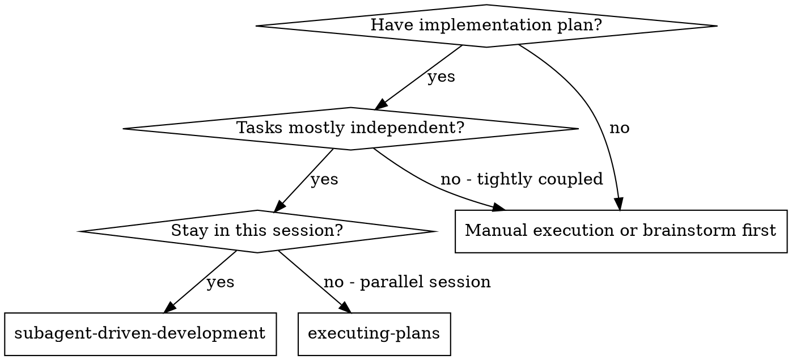
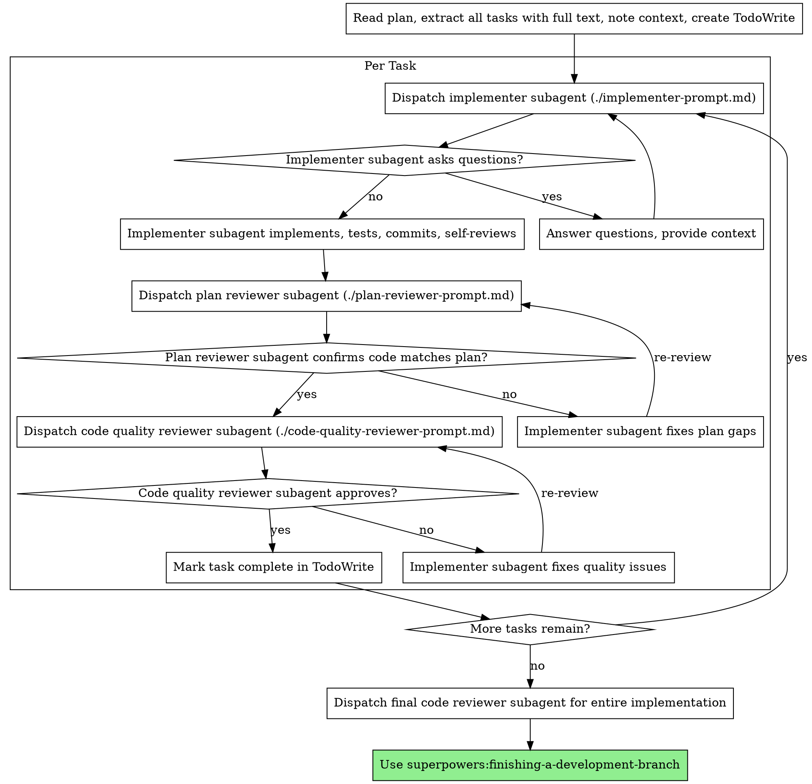

# Subagent-Driven Development

Execute plan by dispatching fresh subagent per task, with two-stage review after each: plan compliance review first, then code quality review.

**Why subagents:** You delegate tasks to specialized agents with isolated context. By precisely crafting their instructions and context, you ensure they stay focused and succeed at their task. They should never inherit your session's context or history — you construct exactly what they need. This also preserves your own context for coordination work.

**Core principle:** Fresh subagent per task + two-stage review (plan then quality) = high quality, fast iteration

## When to Use



**vs. Executing Plans (parallel session):**
- Same session (no context switch)
- Fresh subagent per task (no context pollution)
- Two-stage review after each task: plan compliance first, then code quality
- Faster iteration (no human-in-loop between tasks)

## Pre-Dispatch Checklist (Worktree Isolation)

When using `isolation: "worktree"` for subagents, run this check **before every dispatch batch**:

1. **Commit referenced files.** Worktrees check out from a git commit — untracked or uncommitted files in the parent working tree are **invisible** to the worktree. If the plan, spec, or any file the subagent needs is not committed, the subagent will either fail to find it or silently fall back to reading from the parent path, breaking isolation entirely.
   - Run `git status` and verify that any file paths mentioned in your prompt are tracked and committed.
   - If they aren't, commit them (even as a WIP commit) before dispatching.
   - **Or** (preferred): paste the full task text inline in the prompt rather than referencing a file path. This sidesteps the issue entirely and is already recommended by the implementer prompt template.

2. **Verify isolation after dispatch.** When the subagent returns, check the tool result for a `worktreePath` and `worktreeBranch`. If these are missing but the agent reports making commits, assume isolation failed — the agent likely operated on the parent working tree, and when multiple agents are dispatched in parallel, may have cross-contaminated with sibling agents. Signs of broken isolation:
   - Agent reports `Branch: master` (or whatever the parent branch is) instead of a `worktree-agent-*` branch.
   - Agent's Bash commands use `cd /path/to/parent/repo` instead of the worktree path.
   - The worktree directory doesn't exist on disk after the agent completes.
   - Uncommitted changes appear in the parent working tree matching the agent's reported work.
   - Merges fail with `not something we can merge` — the `worktree-agent-*` branch the agent claimed to commit on never existed because isolation failed.
   - One agent's commit includes files that were only staged by another sibling agent (cross-contamination via the shared parent tree).

   If you see any of these signs, stop and investigate before dispatching more parallel work.

3. **Recovery if isolation fails.** If an agent operated on the parent tree:
   - Check `git status` in the parent for the agent's changes.
   - Verify tests pass on those changes.
   - Commit them manually with the planned commit message.
   - Do **not** re-dispatch — the work is done, just in the wrong place.

4. **Permission allowlist must live in global settings.** When subagents are dispatched with `isolation: "worktree"`, their cwd becomes `<repo>/.claude/worktrees/agent-xxx/`. Claude Code's permission resolution searches upward for `.claude/settings.local.json` but stops at the worktree boundary (the `.git` file there makes the worktree its own root) — it does **not** find the outer project's `.claude/settings.local.json`. Effect: project-local grants like `Bash(*)` don't apply to worktree subagents, and they stall on permission prompts that the user can't see (especially under `run_in_background: true`).

   Put broad grants in `~/.claude/settings.json` (global user settings) so they apply everywhere including worktrees:

   ```json
   { "permissions": { "allow": ["Bash(*)"] } }
   ```

## Post-Dispatch: Merging Parallel Branches

When a wave of parallel implementers all return cleanly, each on its own `worktree-agent-*` branch with disjoint files:

**Cherry-pick for linear history.** Cherry-pick each agent's commit onto main rather than merging each branch with `--no-ff`:

```bash
git cherry-pick <sha1> <sha2> <sha3> ...
```

This produces a clean linear history. Conflict-free as long as each worktree touched different files. `git merge --no-ff` per-branch generates a merge commit per branch — noisy and unnecessary when the branches are each `main + 1 commit`.

**Cleanup after merge.** Remove the worktrees and delete the branches, or `.claude/worktrees/` accumulates inherited cruft and the branch list gets messy:

```bash
for w in agent-X agent-Y agent-Z; do
  git worktree remove --force .claude/worktrees/$w
  git branch -D worktree-agent-$w
done
```

**CRITICAL pitfall — never `git add -A` while worktrees exist.** If `.claude/worktrees/` contains active worktrees, `git add -A` from the parent working tree picks them up as **embedded git repositories** (gitlinks/submodules) and silently adds them to the index. Committing then pollutes main with submodule references that don't resolve.

If it happens:
```bash
git reset --soft HEAD~1                  # undo the bad commit, keep staging
git restore --staged .claude/worktrees/  # unstage the gitlinks
git commit -m "..."                      # re-commit the legitimate changes
```

Prevent it by staging files explicitly (`git add file1 file2 ...`) while worktrees are alive. Once worktrees are removed, `git add -A` is safe again.

**Reviews can be parallel too.** Spec compliance and code quality reviewers are read-only — after all implementers return, dispatch all spec reviewers in parallel, wait, then dispatch all quality reviewers in parallel. Two waves of N parallel reviewers, no contention.

## The Process



## Model Selection

Use the least powerful model that can handle each role to conserve cost and increase speed.

**Mechanical implementation tasks** (isolated functions, clear specs, 1-2 files): use a fast, cheap model. Most implementation tasks are mechanical when the plan is well-specified.

**Integration and judgment tasks** (multi-file coordination, pattern matching, debugging): use a standard model.

**Architecture, design, and review tasks**: use the most capable available model.

**Task complexity signals:**
- Touches 1-2 files with a fully-specified task → cheap model
- Touches multiple files with integration concerns → standard model
- Requires design judgment or broad codebase understanding → most capable model

## Handling Implementer Status

Implementer subagents report one of four statuses. Handle each appropriately:

**DONE:** Proceed to plan compliance review.

**DONE_WITH_CONCERNS:** The implementer completed the work but flagged doubts. Read the concerns before proceeding. If the concerns are about correctness or scope, address them before review. If they're observations (e.g., "this file is getting large"), note them and proceed to review.

**NEEDS_CONTEXT:** The implementer needs information that wasn't provided. Provide the missing context and re-dispatch.

**BLOCKED:** The implementer cannot complete the task. Assess the blocker:
1. If it's a context problem, provide more context and re-dispatch with the same model
2. If the task requires more reasoning, re-dispatch with a more capable model
3. If the task is too large, break it into smaller pieces
4. If the plan itself is wrong, escalate to the human

**Never** ignore an escalation or force the same model to retry without changes. If the implementer said it's stuck, something needs to change.

## Plan-File Maintenance

The plan file is part of the work history. The controller is
responsible for keeping it in sync; implementer subagents touch it
only on explicit instruction. (The existing red flag *"Make subagent
read plan file (provide full text instead)"* still applies — the
implementer never reads the plan to understand its task.)

**Per-task commit:** When dispatching an implementer, include in the
prompt: *"After your work commit, also flip these checkboxes in
`<plan-file-path>` from `- [ ]` to `- [x]`: <list of step lines for
this task>."* The implementer's commit will contain code + checkbox
flips together. The diff narrates "task N: done."

**Phase boundary commit:** When dispatching the first implementer of
a new phase (after the previous phase's last task was reviewed and
approved), include in the prompt: *"Before your work, delete lines
`<X-Y>` of `<plan-file-path>` (the now-complete prior phase plus its
preamble). Then proceed."* That implementer's single commit then
does three things: delete the old phase, do the new task's work,
flip the new task's checkboxes.

**Why pruning lags by one commit:** each commit's diff should
narrate what it accomplished — newly-completed tasks show as
strikethrough, then the next phase opens by sweeping them out. If
checkbox-flip and section-delete were in the same commit, the diff
would show "minus task X, plus nothing" with no record of what
finished.

**Subagent context:** Implementer and plan-compliance reviewer
subagents receive the plan header (Goal / Architecture / Tech Stack)
in addition to the task text — the header is the design rationale
that survived from brainstorming, and subagents need it to make
consistent architectural choices. The existing red flag against
making subagents *locate and read* the plan file still applies; the
controller pastes the header into the prompt.

**Branch finish:** `finishing-a-development-branch` deletes the
plan file entirely after any durable insight is folded into real
docs. Don't preempt that step.

**See also:** `executing-plans` "Drift, Divergence, and
Self-Documenting Code" — the drift-handling rules apply identically
here. The controller should reject implementer work that ratifies
drift instead of fixing it or flagging it as a possible plan defect.

## Prompt Templates

- `./implementer-prompt.md` - Dispatch implementer subagent
- `./plan-reviewer-prompt.md` - Dispatch plan compliance reviewer subagent
- `./code-quality-reviewer-prompt.md` - Dispatch code quality reviewer subagent

## Example Workflow

```
You: I'm using Subagent-Driven Development to execute this plan.

[Read plan file once: docs/superpowers/plans/feature-plan.md]
[Extract all 5 tasks with full text and context]
[Create TodoWrite with all tasks]

Task 1: Hook installation script

[Get Task 1 text and context (already extracted)]
[Dispatch implementation subagent with full task text + context]

Implementer: "Before I begin - should the hook be installed at user or system level?"

You: "User level (~/.config/superpowers/hooks/)"

Implementer: "Got it. Implementing now..."
[Later] Implementer:
  - Implemented install-hook command
  - Added tests, 5/5 passing
  - Self-review: Found I missed --force flag, added it
  - Committed

[Dispatch plan compliance reviewer]
Plan reviewer: ✅ Plan compliant - all requirements met, nothing extra

[Get git SHAs, dispatch code quality reviewer]
Code reviewer: Strengths: Good test coverage, clean. Issues: None. Approved.

[Mark Task 1 complete]

Task 2: Recovery modes

[Get Task 2 text and context (already extracted)]
[Dispatch implementation subagent with full task text + context]

Implementer: [No questions, proceeds]
Implementer:
  - Added verify/repair modes
  - 8/8 tests passing
  - Self-review: All good
  - Committed

[Dispatch plan compliance reviewer]
Plan reviewer: ❌ Issues:
  - Missing: Progress reporting (plan says "report every 100 items")
  - Extra: Added --json flag (not requested)

[Implementer fixes issues]
Implementer: Removed --json flag, added progress reporting

[Plan reviewer reviews again]
Plan reviewer: ✅ Plan compliant now

[Dispatch code quality reviewer]
Code reviewer: Strengths: Solid. Issues (Important): Magic number (100)

[Implementer fixes]
Implementer: Extracted PROGRESS_INTERVAL constant

[Code reviewer reviews again]
Code reviewer: ✅ Approved

[Mark Task 2 complete]

...

[After all tasks]
[Dispatch final code-reviewer]
Final reviewer: All requirements met, ready to merge

Done!
```

## Advantages

**vs. Manual execution:**
- Subagents follow TDD naturally
- Fresh context per task (no confusion)
- Parallel-safe (subagents don't interfere)
- Subagent can ask questions (before AND during work)

**vs. Executing Plans:**
- Same session (no handoff)
- Continuous progress (no waiting)
- Review checkpoints automatic

**Efficiency gains:**
- No file reading overhead (controller provides full text)
- Controller curates exactly what context is needed
- Subagent gets complete information upfront
- Questions surfaced before work begins (not after)

**Quality gates:**
- Self-review catches issues before handoff
- Two-stage review: plan compliance, then code quality
- Review loops ensure fixes actually work
- Plan compliance prevents over/under-building
- Code quality ensures implementation is well-built

**Cost:**
- More subagent invocations (implementer + 2 reviewers per task)
- Controller does more prep work (extracting all tasks upfront)
- Review loops add iterations
- But catches issues early (cheaper than debugging later)

## Red Flags

**Never:**
- Start implementation on main/master branch without explicit user consent
- Skip reviews (plan compliance OR code quality)
- Proceed with unfixed issues
- Dispatch multiple implementation subagents in parallel (conflicts)
- Make subagent read plan file (provide full text instead — also prevents worktree isolation failures when the file isn't committed)
- Dispatch worktree-isolated subagents when the plan/spec files are uncommitted (worktrees can't see untracked parent files)
- Skip scene-setting context (subagent needs to understand where task fits)
- Ignore subagent questions (answer before letting them proceed)
- Accept "close enough" on plan compliance (plan reviewer found issues = not done)
- Skip review loops (reviewer found issues = implementer fixes = review again)
- Let implementer self-review replace actual review (both are needed)
- **Start code quality review before plan compliance is ✅** (wrong order)
- Move to next task while either review has open issues

**If subagent asks questions:**
- Answer clearly and completely
- Provide additional context if needed
- Don't rush them into implementation

**If reviewer finds issues:**
- Implementer (same subagent) fixes them
- Reviewer reviews again
- Repeat until approved
- Don't skip the re-review

**If subagent fails task:**
- Dispatch fix subagent with specific instructions
- Don't try to fix manually (context pollution)

## Integration

**Required workflow skills:**
- **superpowers:using-git-worktrees** - REQUIRED: Set up isolated workspace before starting
- **superpowers:writing-plans** - Creates the plan this skill executes
- **superpowers:requesting-code-review** - Code review template for reviewer subagents
- **superpowers:finishing-a-development-branch** - Complete development after all tasks

**Subagents should use:**
- **superpowers:test-driven-development** - Subagents follow TDD for each task

**Alternative workflow:**
- **superpowers:executing-plans** - Use for parallel session instead of same-session execution
